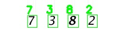

# Simple Captcha Breaker

Convolutional Neural Network (CNN)-based captcha breaker. 

<p  align='center'>
    </img>
</p>

## Usage

* [model.ipynb](model.ipynb) - contains model training and test steps

* [break_captcha.py](break_captcha.py) - script for breaking a sinlge captcha using a pre-trained CNN

    ```
    usage: break_captcha.py [-h] -i IMAGE_PATH -m MODEL_PATH [-o OUTPUT_PATH]

    optional arguments:
    -h, --help            show this help message and exit
    -i IMAGE_PATH, --image-path IMAGE_PATH
                            path to a captcha image
    -m MODEL_PATH, --model-path MODEL_PATH
                            path to a model
    -o OUTPUT_PATH, --output-path OUTPUT_PATH
                            path to save the output to
    ```

* [download_images.py](download_images.py) - script for downloading raw captcha images

    ```
    usage: download_images.py [-h] -o OUTPUT [-n NUM_IMAGES]

    optional arguments:
    -h, --help            show this help message and exit
    -o OUTPUT, --output OUTPUT
                            path to output directory of images
    -n NUM_IMAGES, --num-images NUM_IMAGES
                            number of images to download
    ```

* [annotate_images.py](annotate_images.py) - script for annotating captcha images

    ```
    usage: annotate_images.py [-h] -i INPUT -o OUTPUT

    optional arguments:
    -h, --help            show this help message and exit
    -i INPUT, --input INPUT
                            path to input directory of images
    -o OUTPUT, --output OUTPUT
                            path to output directory of annotated images
    ```


