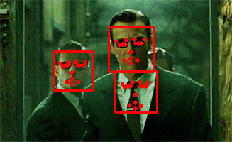

# Facial Landmarks Detection

End-to-end CNN-based detection of facial landmarks in a video stream in real-time.

<p  align='center'>
    </img>
    </img>
</p>

## Usage

[detect.py](detect.py) - script for detecting facial landmarks in video files or streams in real-time

```
usage: detect.py [-h] -c CASCADE_PATH -m MODEL_PATH [-v VIDEO_PATH]
                 [-o OUTPUT_PATH]

optional arguments:
  -h, --help            show this help message and exit
  -c CASCADE_PATH, --cascade_path CASCADE_PATH
                        path to the face haar cascade
  -m MODEL_PATH, --model_path MODEL_PATH
                        path to a trained CNN facial landmarks model
  -v VIDEO_PATH, --video_path VIDEO_PATH
                        path to a video file (optional)
  -o OUTPUT_PATH, --output_path OUTPUT_PATH
                        path to save the output to (optional)
```

## Data 

CNN model was trained on facial landmarks data from [Kaggle](https://www.kaggle.com/c/facial-keypoints-detection/data)

